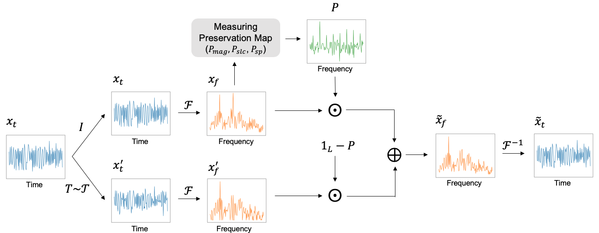

<h1 align="center">SimPSI: A Simple Strategy to Preserve Spectral Information in Time Series Data Augmentation</h1>
<p align="center">

</p>
<!-- <h5 align="center"> A SimPSI diagram. </h5> -->

Updates:
 - Jan, 2025: We have updated the arxived paper to the camera-ready version of AAAI 2024, and attached the appendix.

### Paper
Official source code for ["SimPSI: A Simple Strategy to Preserve Spectral Information in Time Series Data Augmentation"](https://arxiv.org/abs/2312.05790), AAAI 2024 [[1]](#ref).

We propose a simple strategy to preserve spectral information (SimPSI) in time series data augmentation. SimPSI preserves the spectral information by mixing the original and augmented input spectrum weighted by a preservation map, which indicates the importance score of each frequency. Specifically, our experimental contributions are to build three distinct preservation maps: magnitude spectrum, saliency map, and spectrum-preservative map.

## Prerequisites
- Linux or macOS
- Python 3
- CPU or NVIDIA GPU + CUDA CuDNN

## Signal Demodulation (Simulation)

- Simulation dataset can be generated by running the [code](simulation/data_generation/simulation_dataset_generation.m) on MATLAB.

- Training with SimPSI (Magnitude spectrum and Saliency map)
```bash
cd simulation
python train_nonctr.py --data_name matlab_awgn_32fsk_snr_p10p28 --exp_name ${EXP_NAME} --n_class 32 --aug_list ${AUG_LIST} --prior ${PRSRVN_MAP} --seed ${SEED}
```
where ```EXP_NAME``` is the name of the experiment, ```AUG_LIST``` is a sequence of random augmentations (e.g., scale shift jitter), ```PRSRVN_MAP``` is a type of preservation map (i.e., mag or slc), and ```SEED``` is a random seed value.

- Training with SimPSI (Spectrum-preservative map)
```bash
cd simulation
python train_ctr.py --data_name matlab_awgn_32fsk_snr_p10p28 --exp_name ${EXP_NAME} --n_class 32 --aug_list ${AUG_LIST} --prior self --equalizer transformer --seed 
```
where ```EXP_NAME``` is the name of the experiment, ```AUG_LIST``` is a sequence of random augmentations (e.g., scale shift jitter), and ```SEED``` is a random seed value.

- Testing
```bash
cd simulation
python test.py --data_name matlab_awgn_32fsk_snr_p10p28 --exp_name ${EXP_NAME} --n_class 32
```
where ```EXP_NAME``` is the name of the experiment.

## Human Activity Recognition (HAR)

- Training and Testing with SimPSI (Magnitude spectrum and Saliency map)
```bash
cd har_sleepedf
python main.py --experiment_description har_${PRSRVN_MAP} --run_description ${EXP_NAME} --selected_dataset HAR --aug_list ${AUG_LIST} --prior ${PRSRVN_MAP} --equalizer conv --eq_kernel_size 9 --mode ce --seed ${SEED}
```
where ```PRSRVN_MAP``` is a type of preservation map (i.e., mag or slc), ```EXP_NAME``` is the name of the experiment, ```AUG_LIST``` is a sequence of random augmentations (e.g., scale shift jitter), and ```SEED``` is a random seed value.

- Training and Testing with SimPSI (Spectrum-preservative map)
```bash
cd har_sleepedf
python main.py --experiment_description har_self --run_description ${EXP_NAME} --selected_dataset HAR --aug_list ${AUG_LIST} --prior self --equalizer transformer --mode ctr --seed ${SEED}
```
where ```EXP_NAME``` is the name of the experiment, ```AUG_LIST``` is a sequence of random augmentations (e.g., scale shift jitter), and ```SEED``` is a random seed value.

## Sleep Stage Detection (SleepEDF)

- Training and Testing commands are the same as HAR, by replacing har and HAR to sleepedf and SleepEDF, respectively.

## Atrial Fibrillation Classification (Waveform)

- Training and Testing with SimPSI (Magnitude spectrum and Saliency map)
```bash
cd waveform
python -m evaluations.main_nonctr --experiment_description waveform_${PRSRVN_MAP} --run_description ${EXP_NAME} --aug_list ${AUG_LIST} --prior ${PRSRVN_MAP} --seed ${SEED}
```
where ```PRSRVN_MAP``` is a type of preservation map (i.e., mag or slc), ```EXP_NAME``` is the name of the experiment, ```AUG_LIST``` is a sequence of random augmentations (e.g., scale shift jitter), and ```SEED``` is a random seed value.

- Training and Testing with SimPSI (Spectrum-preservative map)
```bash
cd waveform
python -m evaluations.main_ctr --experiment_description waveform_self --run_description ${EXP_NAME} --aug_list ${AUG_LIST} --prior self --seed ${SEED}
```
where ```EXP_NAME``` is the name of the experiment, ```AUG_LIST``` is a sequence of random augmentations (e.g., scale shift jitter), and ```SEED``` is a random seed value.

## Citation
<a name="ref"></a>
```bash
@article{ryu2023simpsi,
  title={SimPSI: A Simple Strategy to Preserve Spectral Information in Time Series Data Augmentation},
  author={Ryu, Hyun and Yoon, Sunjae and Yoon, Hee Suk and Yoon, Eunseop and Yoo, Chang D.},
  journal={arXiv preprint arXiv:2312.05790},
  year={2023}
}
```
